# Auto Triggering of Spinnaker Pipeline by Git Push
This guide explains how to configure Spinnaker v1.16.1 to trigger pipelines based on commits to a GitHub repository and inject changed GitHub files as artifacts into a pipeline.

1.	Prerequisites
	
2.	Configure GitHub webhooks
	
3.	Configure a GitHub artifact account
	
4.	Configure Spinnaker Pipeline Trigger
	
5.	Verification
	
## 1. Prerequisites

### 1.1 elasticsearch.log.filesize.in.MB=100GitHub repository either under your user, or in an organization or user’s account that you have permission to publish commits to.

Prepare a GitHub repository with some source code to build and it must contain some source code to build artifact.

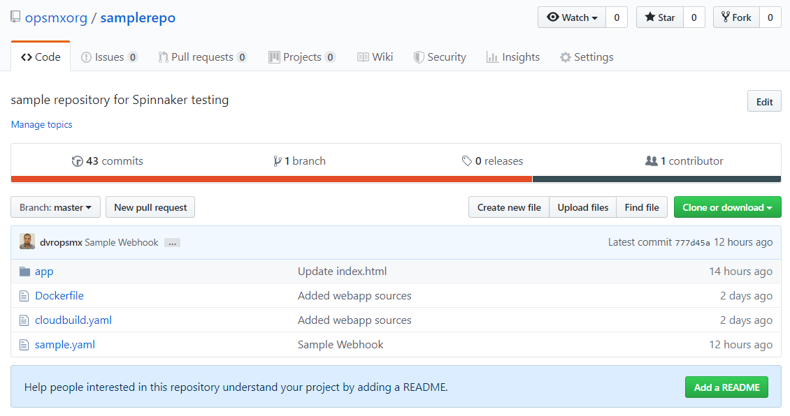

### 1.2 A running Spinnaker instance

## 2. Configure GitHub Webhook

Under GitHub repository, navigate to Settings -> Webhooks -> Add Webhook. Here, provide the following values to the form shown below:

Payload URL:

The Payload URL should be $ENDPOINT/webhooks/git/github

We need Spinnaker’s API running on an endpoint that is publicly reachable. This is required to allow GitHub’s webhooks to reach Spinnaker.

If you’re unsure of what your Spinnaker API endpoint is, check the value of services.gate.baseUrl in 
```yaml
	~/.hal/$DEPLOYMENT/staging/spinnaker.yml.
```
 The value of $DEPLOYMENT is typically default.
 
* Example:

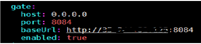

Content type:

The value should be ‘application/json’

Secret:

The value is up to you, and must be provided to any GitHub webhooks triggers that you configure within Spinnaker. It’s used to ensure that only GitHub can trigger your pipelines, not an imposter.

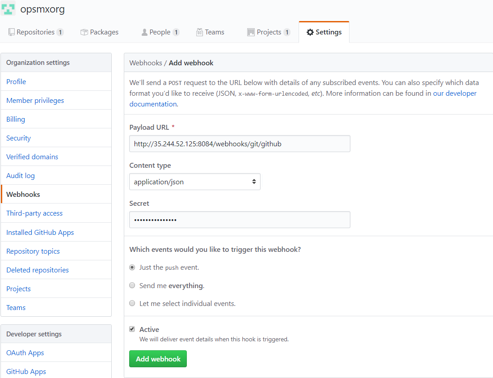

Configure a GitHub Artifact Account

## 3. Configure a GitHub Artifact Account
 Spinnaker can be configured to listen to changes to a repository in GitHub. These steps show you how to configure a GitHub artifact account so that Spinnaker can download files from GitHub.

### 3.1 Downloading Credentials
   
Start by generating an access token for GitHub. The token requires the repo scope.
	
Here Create an access token for GitHub by following the below link:

https://help.github.com/en/articles/creating-a-personal-access-token-for-the-command-line
	
Generate Access token for my GitHub account and downloaded credentials are saved in 

   'github_token_file'.
   
TOKEN_FILE=/home/opsmxuser/dvrs/github/github_token_file

### 3.2 Editing Artifact Settings in Spinnaker Config

Enable GitHub artifact support and add an artifact account:
  
TOKEN_FILE=/home/opsmxuser/dvrs/github/github_token_file	
ARTIFACT_ACCOUNT_NAME=dvr-github-artifact-act

```yaml
	hal config features edit --artifacts true
    hal config artifact github enable
    hal config artifact github account add $ARTIFACT_ACCOUNT_NAME --token-file $TOKEN_FILE
	hal deploy apply
```

## 4.Configure Spinnaker Pipeline Trigger
Configure Spinnaker pipeline to be triggered by a GitHub commit:

### 4.1 Configuration Stage
 
 Create a new pipeline that we want to be triggered on changes to GitHub artifacts.
 
   1.In Pipeline configuration, click the Configuration stage on the far left of the pipeline diagram.
	
   2.Click on Add Artifact under Expected Artifacts section.
	
   3.Select an artifact account that was added earlier (3.2) from Account drop down list and enter the File Path field.
	
   4.Note down the ‘Display name’ which is auto generated and pass this as a value for ‘Artifact Constraints’ for Automated Triggers configuration. 
   
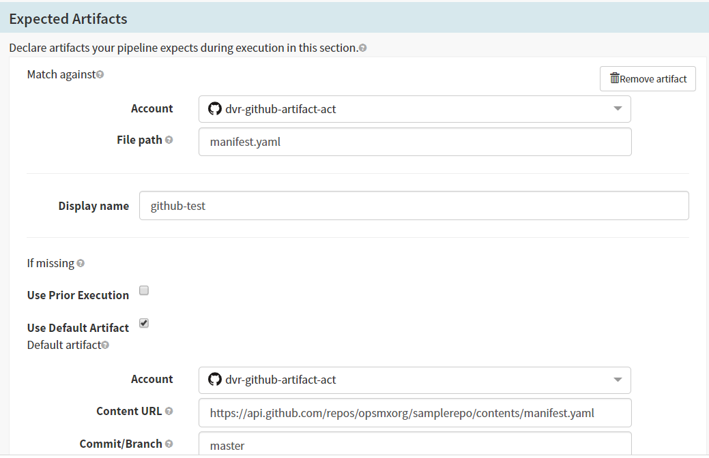
 
 

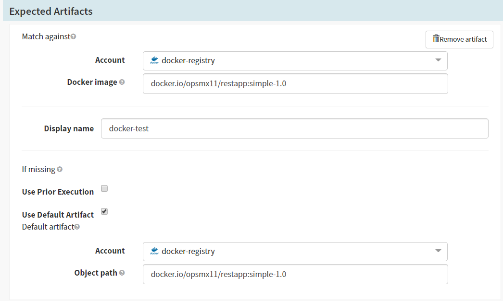

	

   1.Click Automated Triggers.
   
   2.In the Type field, select Git.
   
   3.In the Repo Type field, select github.
   
   4.In the Organization or User field, enter the organization value of your Git repository.
   
   5.In the Project field, enter the Github repository name.
   
   6.Specify the appropriate branch details for Branch.
   
   7.Provide the Secret value that was entered during GitHub Webhook configuration at Section #2.
   
   8.Select the Display name for Artifact Constraints which was generated in Expected Artifacts section.
	
   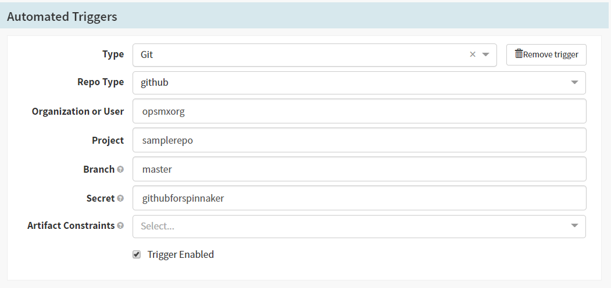

### 4.2 Deploy Kubernetes Manifests

   Select the Deploy (Manifest) stage by specifying the manifests statistically.
    
	
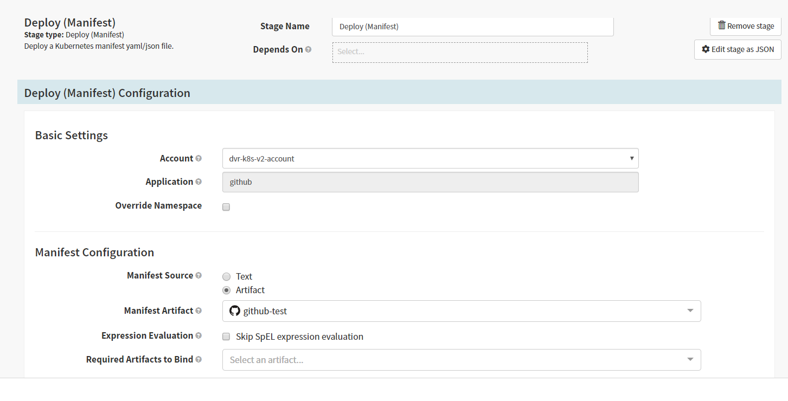	
 	
   
## 5.Verification

 1.Make a change into the repository [https://github.com/opsmxorg/samplerepo.git](https://github.com/opsmxorg/samplerepo.git) for specified Filepath(example: sample.yaml) and ensure Spinnaker’s pipeline is auto triggered.
 
 This can also be verified under Manage Webhook -> Recent Deliveries by checking the Response for 200, which means Github event(commit) has been processed successfully.
 
 
 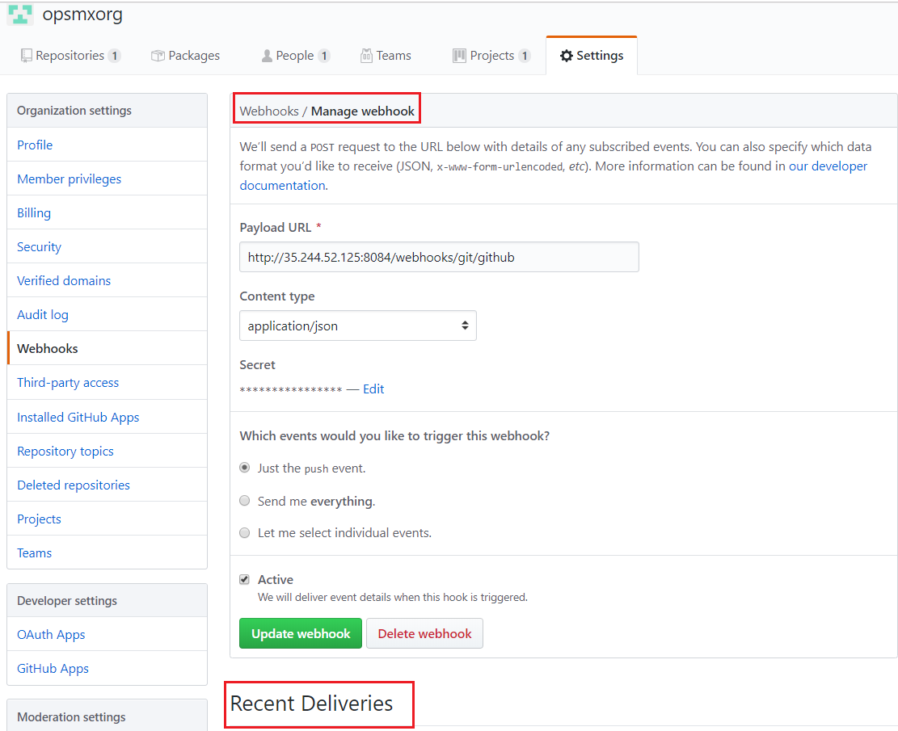
 
 
 
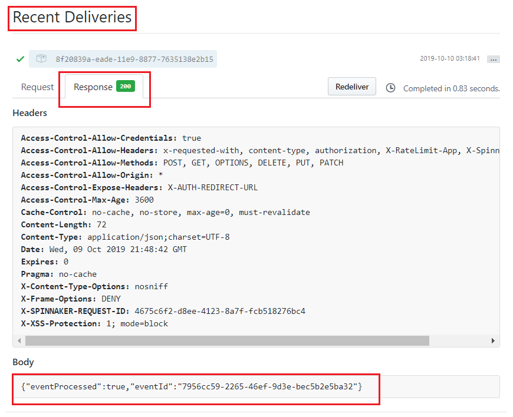	
	
	
 2.Ensure the Google Cloud Build stage is executed successfully as shown below:
 
 Click on Google Cloud Build stage and check the status for SUCCESS. And click on Build Logs for checking logs on Google Cloud Build.
 
 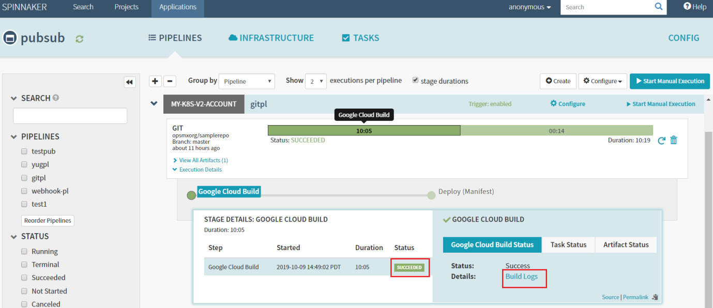
 
 
 
 
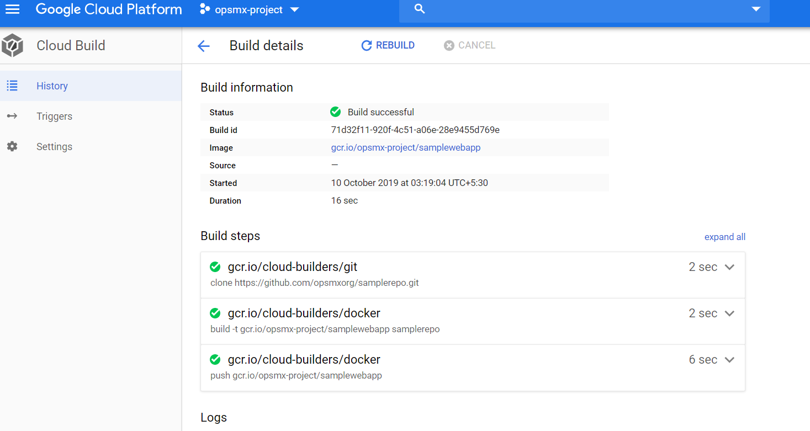


  
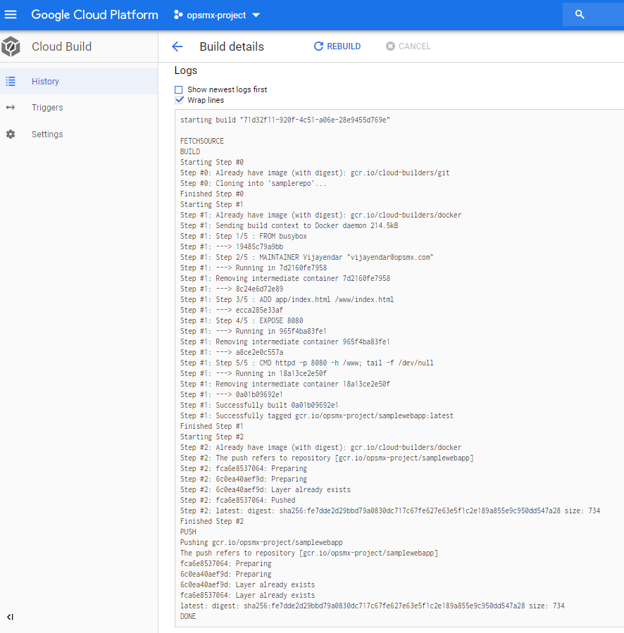
  


 And click on Tasks Status for checking the status on tasks of Google Cloud Build.
 
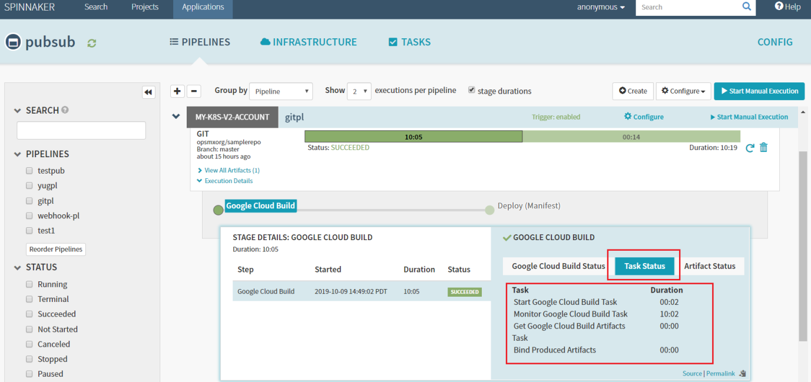

 And ensure the resultant build is available in GCR as shown below:
 


 3.And see the subsequent result in kubernetes cluster as below:
 
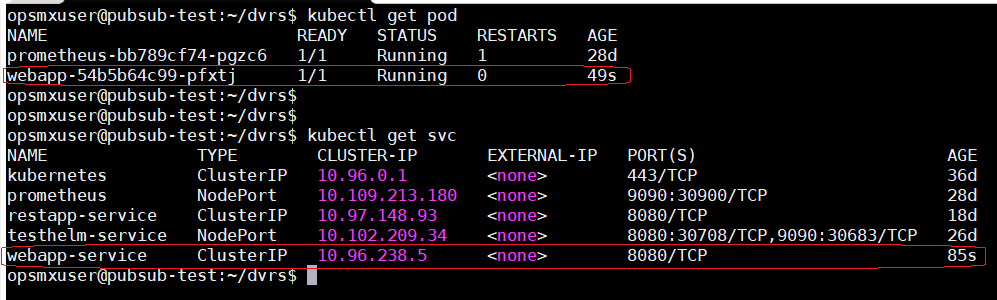

 4.Check the sample webapp result in browser:
 
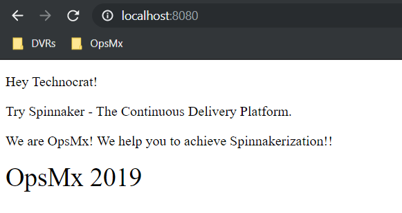


	   


