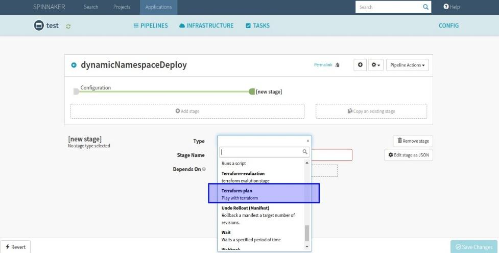
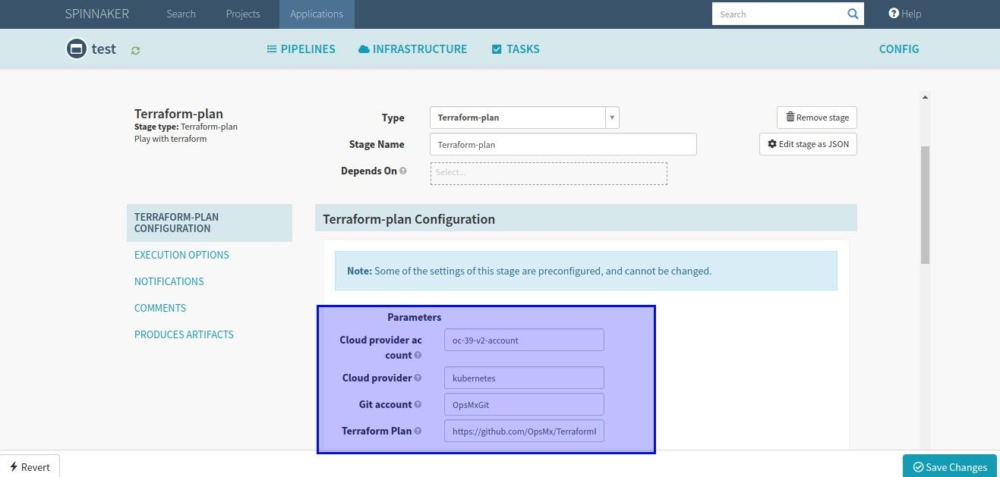
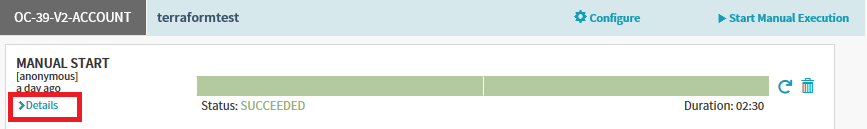
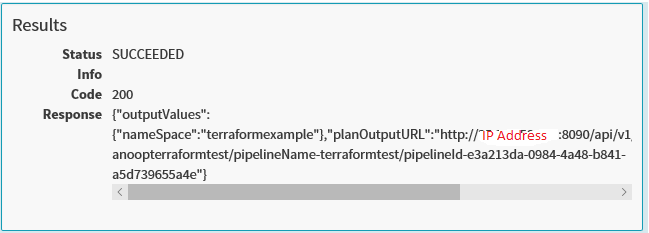
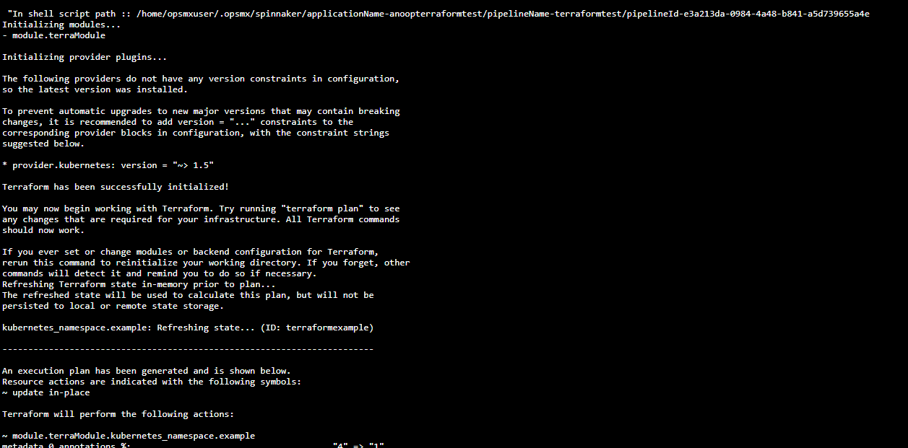

# Terraform Integration with Spinnaker

## Overview
 
 * Terraform is a tool for building, changing, and versioning infrastructure safely and efficiently. Terraform can manage existing and popular service providers as well as custom in-house solutions.
 * In this document, we will explore the options of Integrating Terraform with Spinnaker. By using Terraform as a "planning" step where it generates an execution plan. The execution plan shows what Terraform will do when you call apply. This lets you avoid any surprises when Terraform manipulates infrastructure.
 * OpsMx terraform integration service gives flexibility to run terraform infrastructure plan as a native spinnaker pipeline stage, service will respond back with plan out values so it can be used in next stages of same spinnaker pipeline

## Step by Step Instruction to Setup Spinnaker Pipeline using Terraform

 * Steps to run Terraform infrastructure plan as Spinnaker Pipeline
	1. Create an Application to initiate Pipeline creation.
	2. Click on pipeline configure, add stage from the dropdown select Terraform-plan.
	
	[](../img/terraform/spinnaker-pipeline-usingterraform.jpg)
	
	3. Terraform-plan stage having four input block 
		* Cloud provider account – Provide the Cloud provider account details to specify the account being used for this Terraform Setup.
		* Cloud provider – Provide the Type of Cloud Provider being used, for example – Kubernetes, Openshift etc.
		* GitAccount – Provide the GITAccount details of the Repo being used for the Terraform Setup.
		* Terraform plan – Provide the Terraform Plan Mechanism template which will be customized as per the business requirement.
	4. Use the below URL to access the TerraformPlanModule URL. To access into Module, choose the list of modules available in this Repo
		[https://github.com/OpsMx/TerraformPlansModule.git](https://github.com/OpsMx/TerraformPlansModule.git)
		
		!!!note
			 In case of private Repo, ensure to provide the correct GIT account credentials to auto fetch the required details.
			 
	[](../img/terraform/terraform-plan-stage.jpg)
			 
	5. Click on Add Stage, select Deploy Manifest and from the Basic Setting select the Account Name from the dropdown. Add the below manifest as it is to deploy Terraform for your application
		```yaml
			apiVersion: extensions/v1beta1
			kind: Deployment
			metadata:
			  name: terratest
			  namespace: >-
				${#stage('Terraform-plan')['context']['buildInfo']['outputValues']['nameSpace']}
			spec:
			  replicas: 2
			  selector:
				matchLabels:
				  app: terratest
			  strategy:
				type: RollingUpdate
			  template:
				metadata:
				  labels:
					app: terratest
				spec:
				  containers:
					- image: 'docker.io/opsmx11/restapp:v1'
					  imagePullPolicy: Always
					  name: restapp
					  ports:
						- containerPort: 8090
						  name: http
						  protocol: TCP
		```

	6. Now click on Save Changes. 
		* Upon, successful creation of the pipeline. Test the pipeline by clicking on Start Manual Execution as highlighted in the below screenshot
		[](../img/terraform/startmanual.png)
		* After successful completion of pipeline execution, click on the details dropdown as shown below
		[](../img/terraform/terraform-details.png)
		* From this, user should be able to see the results of pipeline execution. Which will contain a unified URL that gets generated, which can be used to validate the Terraform stage by cross checking the output provided.
		[](../img/terraform/terraform-results.png)
		* By Accessing this URL user should be able to see the Terraform deployment output, as per the below screenshot.
		[](../img/terraform/terraform-deployment-output.png)
