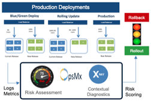

# Autopilot Continuous Verification

## Introduction

The **Autopilot** is a release verification platform that provides Dev/Ops engineers an intelligent automated real-time actionable risk assessment of a new release deployed. The Autopilot verifies latest version of the service comparing to the baseline or prior release after production rollout. The baseline can be deployment from a prior time or current production instance during rollout using canary or blue/green or rolling update strategies.

The **Autopilot** leverages unsupervised and supervised machine learning and Artificial Intelligence (AI) techniques to analyze 1000’s of metrics (infra and APM) and logs data to perform in-depth analysis of architectural regressions, performance, scalability and security violations of new releases in a scalable way for enterprises.

