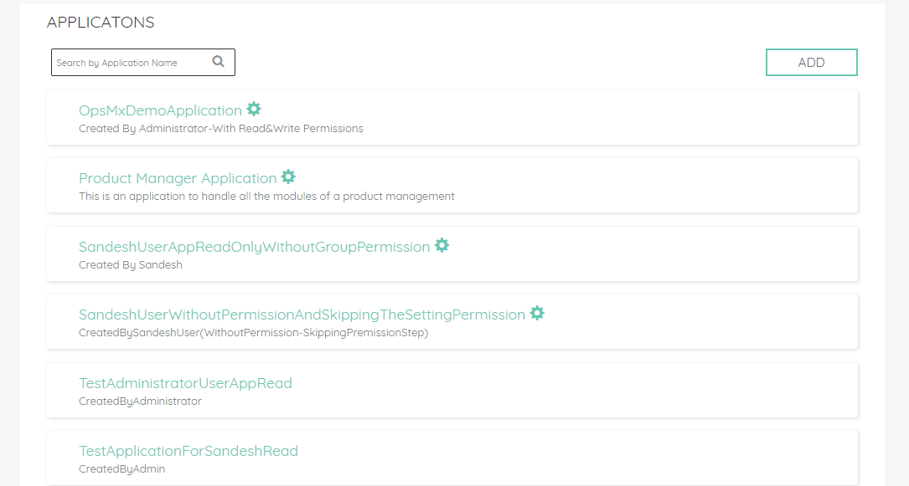
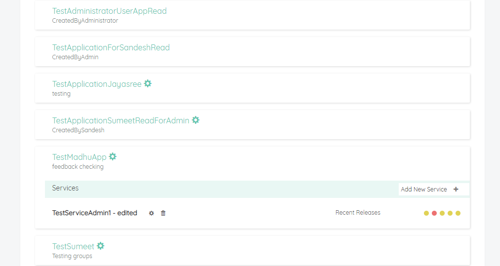
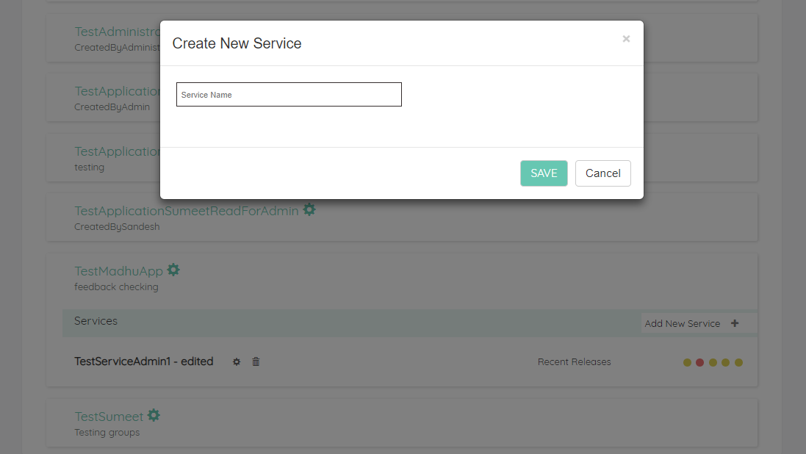
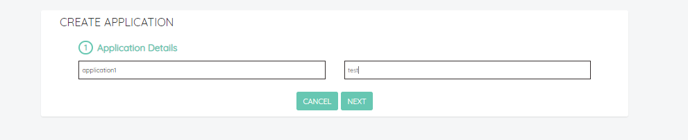
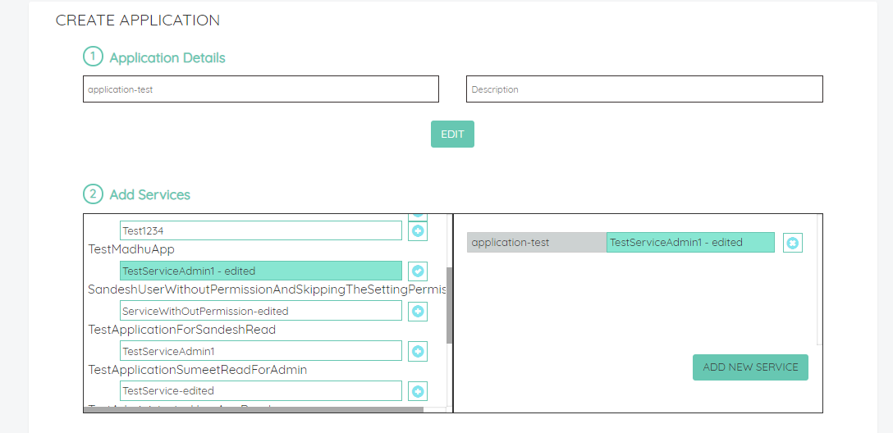
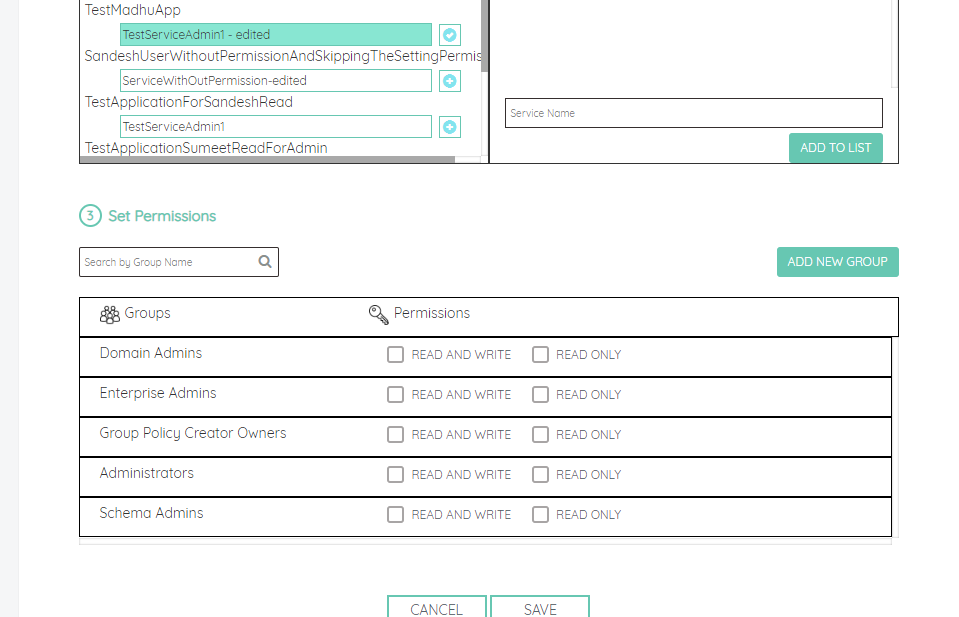

# Configuring Application Dashboard

## Applications

* In the application tab, the logged in user can see the applications pertaining to all the groups to which the user belongs. On clicking on the application name, one can see list of existing services and recent releases associated with that  services.
* New applications can be created by any user with appropriate permissions settings. Ability to add or modify a service within an existing application is based on the permission level for the application for the logged in user/usergroup.

## Services

* At least one service needs to be added while creating a new application. New services can be added by clicking on the add new service button on the right side of the application section. Existing services can be edited or removed based on the user’s permission level for that application. The recent analysis reports pertaining to any services can be viewed by clicking on the colored circle. On clicking on the colored circle or the service name, the user will be redirected to the analysis report tab where the user can review the specific report or review all available reports.

## Adding New Application

* New application can be added by clicking on the Add button on the top right of the Applicaiton tab page. and entering the application name and description. Application name has to be unique. 

*  User then add services (existing services from existing applications or a new service) and set up appropriate permission for the Application. 

* Groups listed are based on the LDAP groups for the users who are currently logged in or have logged in atleast once.

