# Customize Templates

## Configuring Metric Templates

Service cookbooks are a way to specify on how to evaluate a service through specific critical metrics and watchlist metrics. OpsMx machine learning algorithm starts with a default cookbook for all known services (e.g., Tomcat, MySQL, etc.). For custom services, a template for cookbook will be generated from metric datastore (e.g., Datadog) based on the service name and system metrics. Applications developers and operators can customize the cookbook further with their understanding of the service.

**Step 1:**  Click on “SETUP” from the Main menu

**Step 2:**  Click on “APPLICATION TEMPLATE” tab

**Step 3:**  Click on “+” Button

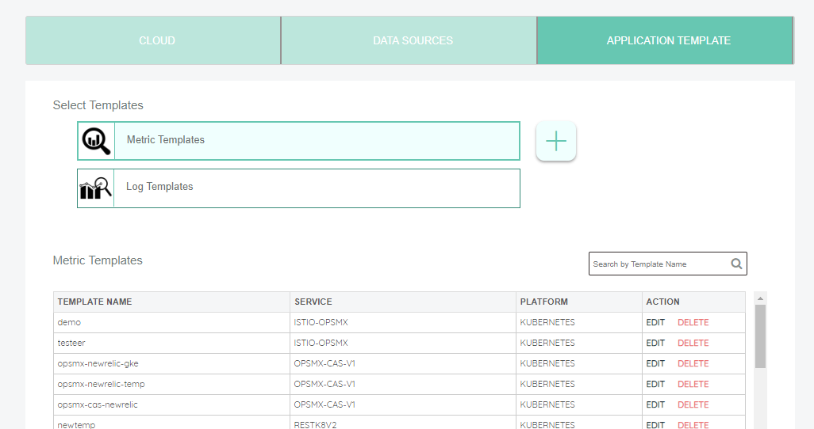

## Configure Template Name

**Step 4:** For the configuration of new Template, enter Template-Name in the textbox, and choose Cloud-Provider as (Kubernetes,AWS...or Custom) then continue by clicking on “NEXT” Button. If no specific information is being used from the Cloud-Provider, you can use the generic cloud provider as depicted below.
 
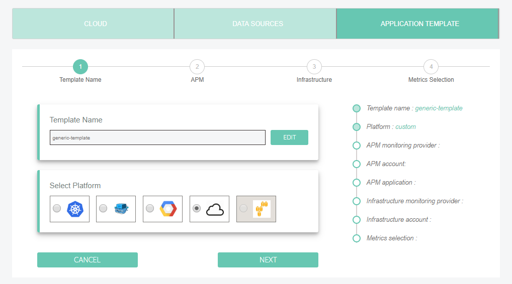

**Note: At-least one of APM or Infrastructure metrics need to chosen**
APM - Refers to API level monitoring and metrics.
Infrastructure - Refers to vital stats of the VM/Container like Memory, CPU usage etc. 

### APM Configuration

**Step 5:** Choose “Monitoring Provider” as added previously in  “Monitoring Credentials” tab by selecting one at a time Newrelic, Prometheus, Datadog etc

**Step 6:**  Based on selected Service Provider  it shows up with service name you provided then select that service and continue by clicking on “NEXT” Button. 

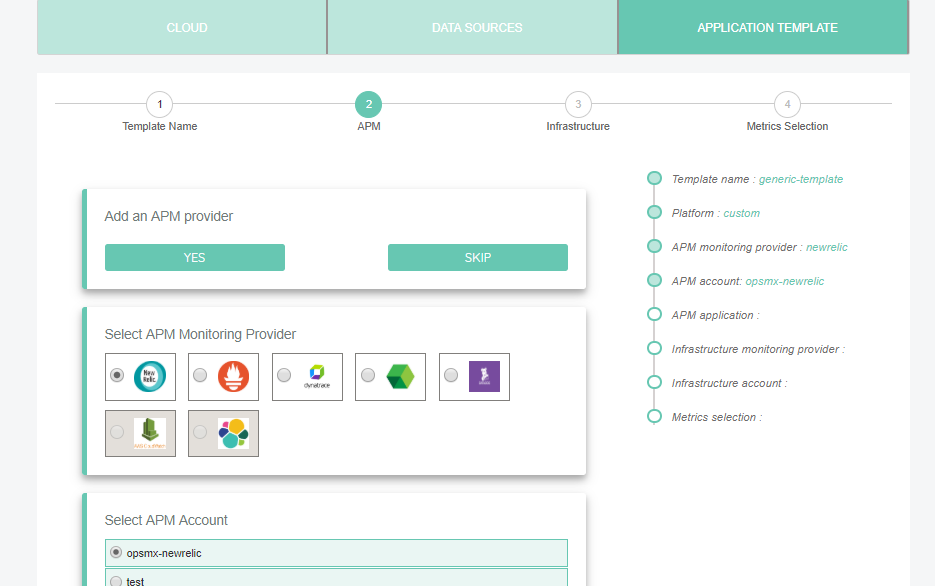

#### Configure Application and API

Based on the selected service it displays the list of applications, choose one of it.

Based on the selected applcation it dispalys the list of API`s. if you want to uncheck any API which is not required, and continue by clicking on “NEXT” Button.

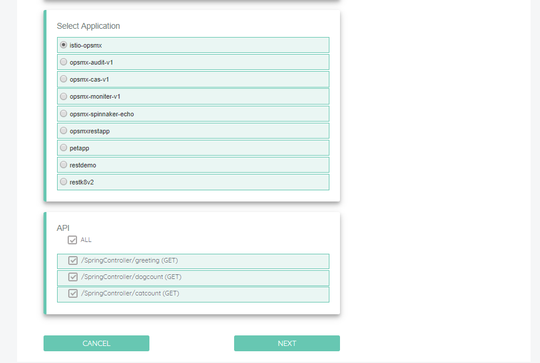


### INFRA Configuration

In this INFRA Configuration ,select Service Provider it shows up with service name you provided then select that service and continue by clicking on “FINISH” Button.

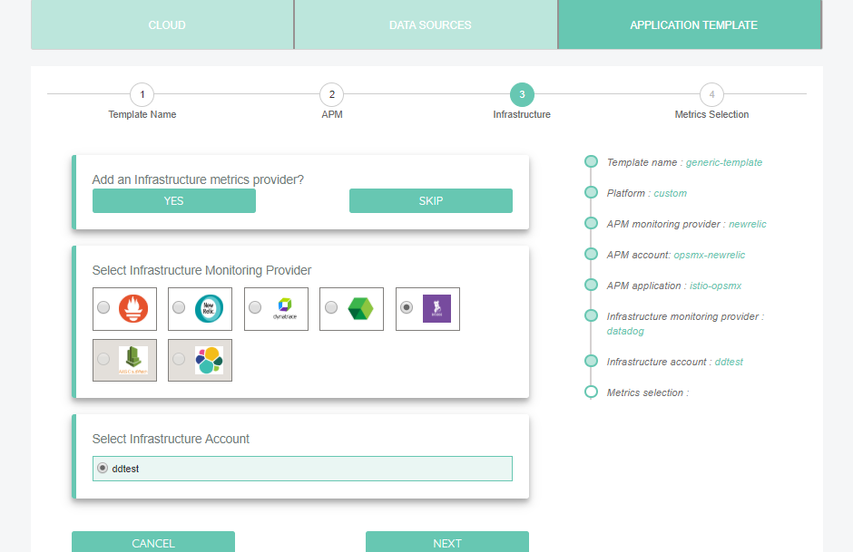

It opens success pop box with all selected API`s list,you can edit Watchlist metrics and Critical metrics by show/hide option on right side.

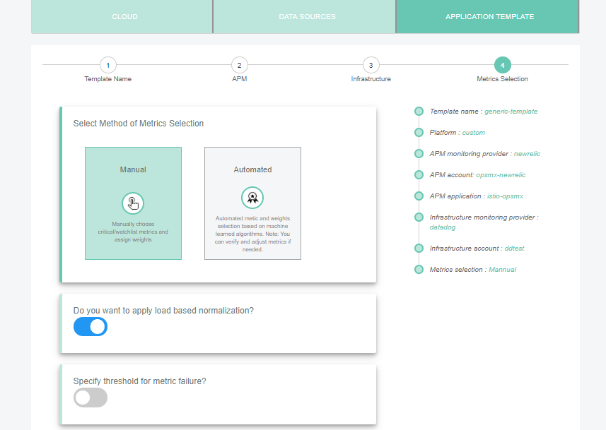

Choose weights for the metric groups that have been selected, to help OpsMx score based on them. 

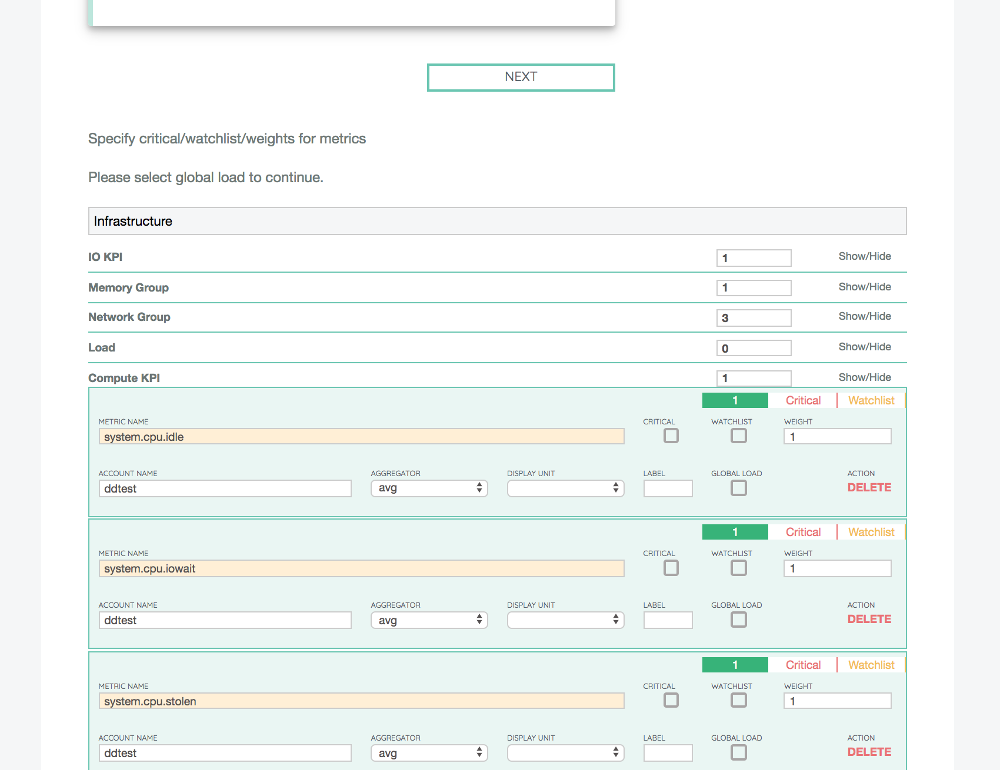

Watchlist metrics are metrics that Developers or Operators typically use to monitor during the manual judgment phase. These metrics will be shown for easier tracking in the scoring page.

For Red/Black ACA,  a metric that represents the load on the server must be set to enable comparing service versions that are run at different times with potentially different environment and load conditions.

** Important: To allow load-based normalisation, atleast one metric needs to be chosen as the global load, after which it gets categorized under the load section. **

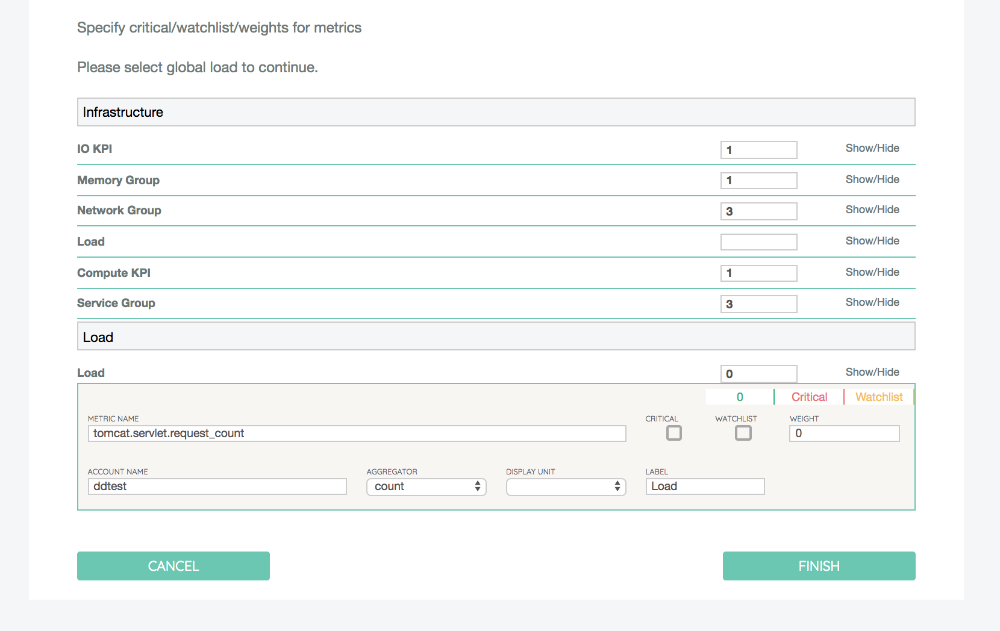

The remaining metrics are used in the final score, but the relative rank and weights are determined by OpsMx machine learning algorithms automatically.

**Step 7:**: Once the update to the cookbook is completed, click “Save” to save the cookbook. The cookbook will be used for analysis and diagnostics for future runs.


## Configure Log Templates

Log templates are  used to aid the  classification of logs messages by  Natural Language Processing (NLP) algorithm with   known error patterns as well domain/app specific messages.  The string pattern specified can be used either classify an error or warning message or to even completely ignore the message.   Once the template is set up, clone the template as a starting point to create new modified  templates for new services.

To create  a new log template, follow the steps below.

### Start the new Template Creation Flow

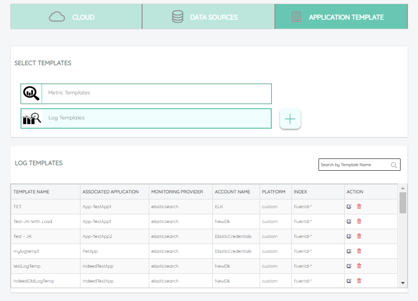


###Template Name, Application, Service & Platform

To create a log template for a service,start with template creation by specifiying a unique name. Next step is to select the platform or cloud environment for this service. 

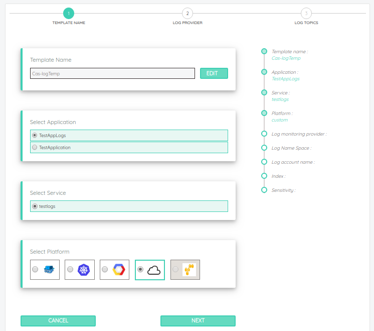


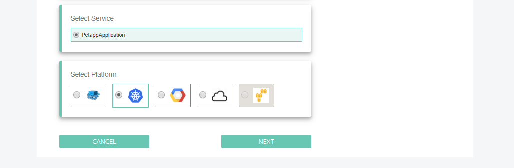

#### Search Index

Index is for elasticsearch query to filter the events.
E.g., logstash-pipeline-*
Sample query to ElasticSearch: 

```yaml
	http://localhost:9200/logstash-pipeline-*/_search
```

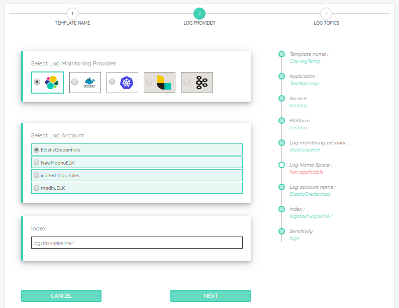


### Monitoring Provider & String Patterns

Next step is specify the monitoring provider  used for aggregating application logs for this service.  User can specify the unique string patterns to match  for error or warning classification.  User can also specific string patterns to be categorized as ignore  (not used in risk scoring) if desired.   Typically,  domain or app specific string patterns are specified to add in classification of the log messages.  

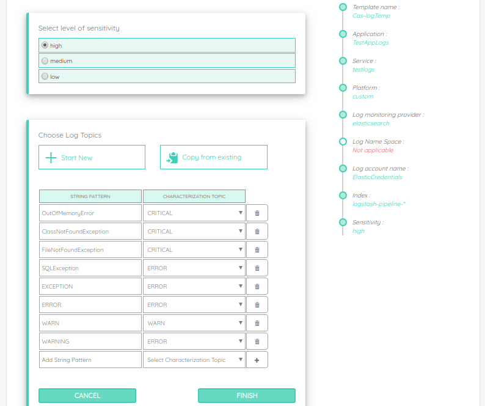

The remaining things in the template creation are same. The only change was creating template for an application and for a service.


