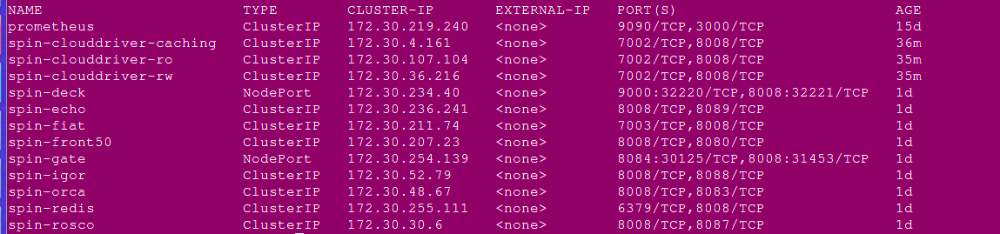
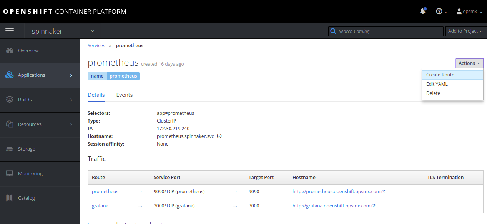
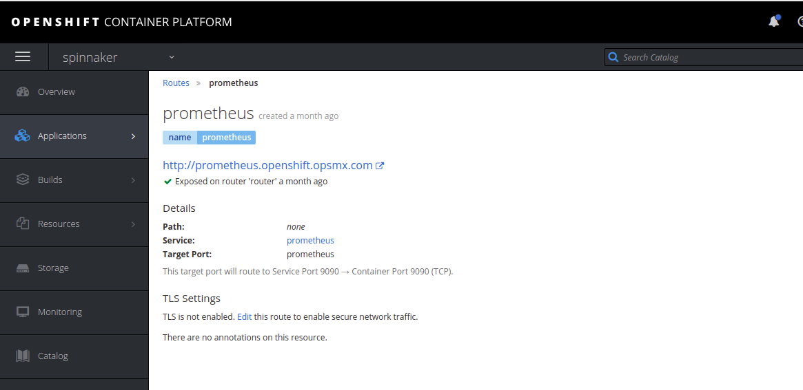

# Enabling Spinnaker Monitoring using Prometheus and Grafana

In this document, we will show how to enable monitoring of Spinnaker using Prometheus with Grafana in an OpneShift environment.

**Here are the prerequisites for the setup in this document:**

* Spinnaker 1.10.0 or above
* Halyard 1.11.0 or above
* Install Clouddriver in the High Availability mode 
* Openshift v3.6 or above
* Spinnaker deployed in Distributed Mode on Openshift/Kubernetes

In this, we have customized the images and deployment objects into a Production ready Openshift environment since the installation of Spinnaker in an Openshift environment needs to set up in a way to allow a non-root user to access the pods or containers.

Images for the Prometheus and Grafana are stored in opsmx11/prometheus repo that is used for monitoring.

So let’s begin by installing Clouddriver which is the heart of Spinnaker in High Availability mode.

**Step 1: Install Clouddriver in High Availability Mode**

<pre><code># hal config deploy ha clouddriver enable</code></pre>

For more details on the Clouddriver in HA mode please visit: [https://www.spinnaker.io/reference/halyard/high-availability/](https://www.spinnaker.io/reference/halyard/high-availability/)

**Step 2: Ensure that the artifact is placed into the monitoring daemon local.**

**Note :** This step is needed only for Spinnaker release **prior** to Spinnaker 1.10.3 to workaround a bug with Prometheus unable to fetch the service-name of clouddriver. This step can be skipped for Spinnaker 1.10.3 or later

<pre><code># vi .hal/default/profiles/monitoring-daemon-local.yml
   artifactId: opsmx11/monitoring:v1
</code>
</pre>

**Step 3: Ensure Spinnaker services are running on port  8008**

**Step 4: Install and run the Prometheus and Grafana Pod**

In this setup, we are using Prometheus and Grafana in a single pod which has been pre-configured dashboards for the Clouddriver in HA mode. 

One can also edit the Prometheus scrape targets, grafana.db, and datasources as they have been accepted as secrets to the pod. This has been done to ensure the users can customize as per their choice.

We have also used a Persistent Volume to ensure that the Prometheus and Grafana data are not all lost whenever the pod restarts. The below mentioned are the deployment files with the service and persistence volume claim yamls.

The files for  the below files can be found in the github repo: [https://github.com/OpsMx/Openshift-Spinnaker/tree/master/prometheus](https://github.com/OpsMx/Openshift-Spinnaker/tree/master/prometheus)

To generate the secret, we would be using the following files.
(These files can be customized as per the requirement changes)

1.  local-prometheus.yml 
2.  Grafana.db  
3.  datasources.yml

<pre><code># oc create secret generic prometheus --from-file=local-prometheus.yml --from-file=grafana.db --from-file=datasources.yml -n spinnaker</code></pre>

So, the secret generated has the name **“prometheus”** and was created in the namespace **“spinnaker”**

Next, we would be generating the service, persistenceVolumeClaim and the Deployment using the files in the same namespace **“spinnaker”** :

1. prom-deploy.yml
2. prom-svc.yml
3. prom-pvc.yml

<pre><code># oc create -f prom-svc.yml -n spinnaker</code></pre>

<pre><code># oc create -f prom-deploy.yml -n spinnaker</code></pre>

<pre><code># oc  create -f prom-pvc.yml -n spinnaker</code></pre>

The image that is being used is opsmx11/prometheus:v1.6.0

**Step 5: Expose port 9090 for Prometheus and 3000 for Grafana**

After the Prometheus-Grafana pod is launched, open the ports on the server’s firewall at 9090 and 3000 on the cloud environment or create routes to the Openshift server.

On GCP, add the custom ports to the VPC Network->  Firewall settings -> tcp:9090,3000
On AWS, add the custom ports to the VPC -> Security Groups-> tcp: 9000, tcp:3000

On Openshift, create routes by going to the service and **Create Route** option:

Once created you can check on the Routes, and details of the route.

Check the route and see if you can reach the Prometheus and Grafana pages.

**Step 6: Redeploy Spinnaker for the custom changes**

We need to re-deploy the spinnaker for the custom changes on monitoring daemon and the clouddriver HA to take effect.

<pre><code># hal deploy apply </code></pre>
