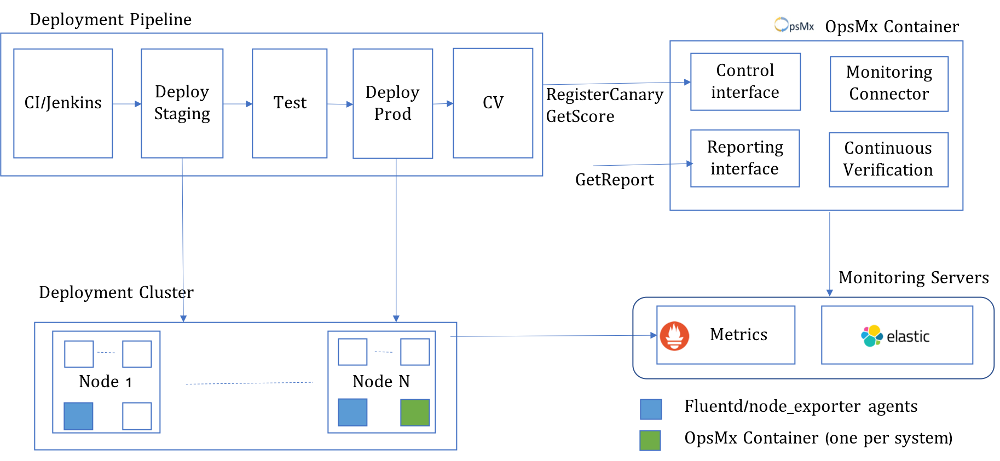

# Getting Started with Continuous Verification 

## Getting Started

AutoPilot Continuous Verification (CV) is a REST service that can be deployed on premise or use managed cloud service for analysis. AutoPilot CV interfaces with monitoring systems for logs and metrics and uses the metadata provided in start analysis phase to retrieve the logs and metrics for deployment verification. AutoPilot CV does not interface with the services deployed directly for its analysis. 

AutoPilot CV can be deployed on premise as a Docker container that can run in Docker Swarm, Kubernetes, Mesos or any platform that supports Docker containers. Figure 2 shows a typical usage pattern for AutoPilot CV with on premise deployment. Deployment Pipeline can be based on Spinnaker or Jenkins for Enterprise Continuous Delivery. AutoPilot CV stage can be integrated with Jenkins pipeline using a wrapper to AutoPilot CV API. In Spinnaker AutoPilot CV integrated natively using ACA stage of Spinnaker. It can also be integrated in pipeline using Webhook stage in Spinnaker. 

*Autopilot Continuous Verification Deployment Configuration*

Enterprises can enable AutoPilot CV for their deployments using three simple steps:

* [Download and run AutoPilot CV](http://docs.opsmx.com/downloadAndRunACV/)
* [Customize templates for services](http://docs.opsmx.com/customizeTemplateForService/)
* [Enable integration into CI/CD pipelines](http://docs.opsmx.com/integrations/cicdPipelines/)

