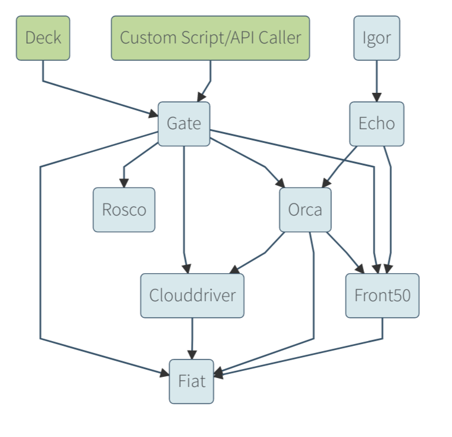

#  Open Enterprise Spinnaker Overview 

 * Spinnaker is an open source, multi-cloud continuous delivery platform for releasing software changes with high velocity and confidence. Spinnaker was originally opensourced by Netflix and since then many orgainzations have contributed code to the project.  
 
 * Open Enterprise Spinnaker (OES) provides additional value on top of the OSS Spinnaker in form of easier life-cycle management of highly available single or multi-Spinnaker deployments in an enterprise, audit and compliance, dashboard for continuous delivery, machine learning based release continuous verification (using logs, APM and metrics), easy application onboarding & maintenance and additional Enterprise cloud driver support such as OpenShift and VMware.
 
 * OES is a non-forked version of OSS spinnaker. The additional value-add is provided as an independent service called Autopilot. OpsMx provides Spinnaker on-boarding/enterprise integration services as well as on-going 24x7 support for Spinnaker. If you are interested in evaluating OES, submit your request to info@opsmx.com. 
 
 * Following are the primary features of OSS Spinnaker
 	* Multi-Cloud Deployment - Deploy your VM or Containers or functions across most public and private clouds including AWS EC2, ECS, EKS, Lambda, Kubernetes, Google Compute Engine, Google Kubernetes Engine, Google App Engine, Microsoft Azure, Openstack, with Oracle Bare Metal and DC/OS..
	* Automated Releases with Pipelines - Create deployment pipelines that run integration and system tests, spin up and down server groups, and monitor your rollouts. Trigger pipelines via git events, Jenkins, Travis CI, Docker, CRON, or other Spinnaker pipelines.
	* Pipeline-as-code - Manage the pipeline as code (JSON) or interact with a pipeline using API or UI.
	* Safe Deployment Strategies - Deploy using Canary or Red/Black (Blue/Green) or Rolling update and enable automated Canary analysis to ensure the safety of the new updates before full-rollout to production
	* 1-click Rollback - Rolling back new deployments is never been easier with a 1-click rollback of images/configurations.

### Spinnaker  Architecture	

The spinnaker platform is based on multiple micro-services. Following diagram shows the micro-services that makes Spinnaker reliable deployment tool for users.

	

