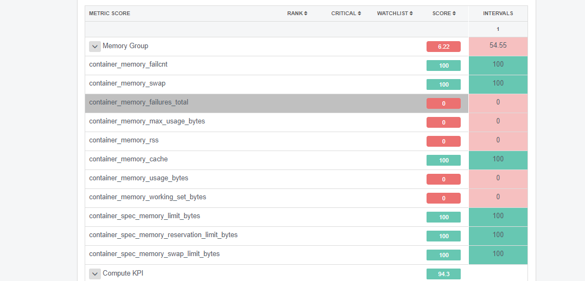

## Continuous Verification Report - An Overview

Modern applications deployments have increased in complexity due to distributed architectures with microservices. Increased number of microservices with multiple developers involved in development and release makes it difficult to track the root cause of failures. Metrics may not always reflect the underlying issue in the initial test, and root cause analysis requires distributed log analysis. The Autopilot performs automated log and metrics analysis for new releases with built-in unsupervised and supervised machine learning algorithms for risk analysis.

The Autopilot log analyzer provides a quick view of failures and new issues by analyzing multiple logs in parallel for a multiservice deployment helping to deploy a new release of an application into production safely.

* **Volume of Data:** Log output for an application during rollout could be thousands of lines per service and if they are multiple services, one could be overwhelmed with the amount of data to analyze to figure out the health of the new application
	
* **Classification of the Data:** Analyzing the data could be tedious even for the most advanced operations team member as some of the messages need an understanding of the application to classify them as a critical or non-critical message. In general, following are the type of logs classification that one has to perform:
		
	* Same messages as previous production release: Many of the log messages (even errors or warning) could be harmless, and they already exist in prior releases and hence could be ignored in the new version as well.
	* New Errors or Warnings messages:  Any new errors or warnings seen in the latest release is a cause of concern and should be flagged as a risk and need to be analyzed.
	* New unknown or safe messages:  New release can output some new unknown (not seen before) or safe messages that could be ignored.  In some cases, one needs an understanding of the application developer to accurately classify these messages.

* **Learning from New Issues:**  Post-mortem analysis of a failed deployment usually ends up identifying new messages that should be classified as error or warnings to prevent future failures.  Ability to continually update one’s understanding of logs is critical for the continued success of production rollout.

The **Autopilot** will make it easy to understand the risk of the particular release and perform all the tasks of a human ops engineer.  Figure 3 shows a sample analysis where the risk score is calculated for a quick summary of the quality of the release which can be used to automate rollback decisions.

## Continuous Verification Result Summary

The OpsMx Continuous Verification report displays the analysis summary of the service’s pipeline run.

## Risk Scoring Summary

Overall Score – Score computed for canary comparison based on individual metrics differences and weights assigned to the metrics based on service characteristics. Score threshold will determine the failure or success of canary comparison.

Confidence Level – Represents the projected accuracy of the score based on the available data for analysis. The confidence level will increase with the increased amount of data available for analysis.

Critical Metrics – User-defined metrics that represent KPI of service behavior. Continuous Verification test will fail if any of the metrics tagged as critical fail in the canary test. If critical metrics are not tagged by the user, the system will treat all metrics equally and will assign rank based on algorithms.

Watchlist Metrics – User-defined metrics that represent intuitive performance measures. These metrics are used for filtering when presenting results with large number of analyzed metrics

## Continuous Verification Result Details

In this example, the canary run is comparing a new version deployment with memory leak introduced and slightly higher throughput than the baseline version.

Score details present each of the metrics and their behavior over the period of the canary run. The default view of the details presents the user with the metrics that are tagged as critical or on the watch list that has failed the canary comparison.

### Log Analysis

As configured Comparison and Baseline versions, Based on configured versions opsmx compares and analysis both log data, displays the score and any differnce between baseline and release version.

The deployment is analysed by the logs of new release against the baseline. The events are categorised into 'UnExpected', 'Expected', 'Baseline' and 'Ignored'. All of these are done through Natural Language Processing. The events are auto-identified by the type of clusters.

Figure: *Autopilot Log Analysis and Risk Scoring*

 

Figure: *Autopilot Supervised Reclassification of Log Messages*

### Metrics Summary

Figure: *Autopilot APM based API Metric Analysis*

Figure: *Autopilot System based Metric Analysis*

As shown in the following diagram, the canary run has a score of 0, and the default view presents system.mem.used metric as high ranking as well as tagged as critical that failed the canary test.

#### Metrics Groups

Metrics are grouped based on the service as well as system level metrics based on network, compute, disk and memory. This grouping allows users to identify high ranking groups and low scoring groups to diagnose the issues.

#### Metric Details

Selecting individual metric in the list shows details of the metric with its statistics, box plots and behavior over the period of canary. Each of the metrics rows has additional details on bucket scores. Each bucket is a timeslice that is used in comparison that allows users to identify trends or a subset of load that could be causing a problem with the new build.

Every metric is ranked based on their particular effect on the service behavior as well as the difference between canary and baseline versions.

The following shows the plot of the metric over the duration of the canary for baseline and canary versions of the service.

The following plot shows the box plot that allows easy detection of trends in the behavior of the metric over the duration of the canary run.

#### Continuous Verification Run Selection

During a canary run, a score can be computed at various intervals as configured by the user. For example in a canary run of 30 mins, the score can be configured to be computed every 10 mins causing the score to be generated 3 times during the canary run. The score details of the canary run at each of the intervals can be analyzed by selected the specific run from the drop-down menu as shown below.

