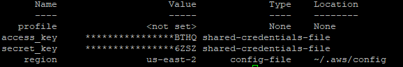

## Overview

* Amazon Elastic Container Service for Kubernetes (Amazon EKS) is a managed service that makes it easy for you to run Kubernetes on AWS without needing to stand up or maintain your own Kubernetes control plane. Kubernetes is an open-source system for automating the deployment, scaling, and management of containerized applications.
* Amazon EKS runs Kubernetes control plane instances across multiple Availability Zones to ensure high availability. Amazon EKS automatically detects and replaces unhealthy control plane instances, and it provides automated version upgrades and patching for them.

## Prerequisites

* Mandatory to have AWS access key and Secret Key.
* Ensure to have AWS IAM Authenticator, AWS CLI, eksctl, git, helm & kubectl Installed and configured on the Server to setup AWS EKS.

## Steps to Setup AWS CLI & aws-iam-authenticator

* To Install AWS CLI on the Server, it’s mandatory to have a valid setup of python. Along with access to run python & pip commands.
* Execute the below command to Install AWS CLI using pip

	```yaml
		pip3 install awscli
	```

* Execute the below command after successful completion of AWS CLI Installation

	```yaml
		$ aws --version
		aws-cli/1.16.101 Python/2.7.6 Linux/4.4.0-135-generic botocore/1.12.91
	```

* Installation of aws-iam-authenticator
* Amazon EKS uses IAM to provide authentication to your Kubernetes cluster through the AWS IAM Authenticator for Kubernetes. Beginning with Kubernetes version 1.10, you can configure the stock kubectl client to work with Amazon EKS by installing the AWS IAM Authenticator for Kubernetes and modifying your kubectl configuration file to use it for authentication.
* Execute the below command to download the aws-iam-authenticator binaries

Linux:
	```yaml
		curl -o aws-iam-authenticator https://amazon-eks.s3-us-west-2.amazonaws.com/1.11.5/2018-12-06/bin/linux/amd64/aws-iam-authenticator
	```
	
MacOS:
	```yaml
		curl -o aws-iam-authenticator https://amazon-eks.s3-us-west-2.amazonaws.com/1.11.5/2018-12-06/bin/darwin/amd64/aws-iam-authenticator
	```
	
Windows:
	```yaml
		curl -o aws-iam-authenticator https://amazon-eks.s3-us-west-2.amazonaws.com/1.11.5/2018-12-06/bin/windows/amd64/aws-iam-authenticator.exe
	```

* (Optional) Execute the below commands to verify the downloaded binaries
* Download the SHA-256 sum for your system. The example below is to download the SHA-256 sum for macOS clients.

	```yaml
		curl -o aws-iam-authenticator.sha256 https://amazon-eks.s3-us-west-2.amazonaws.com/1.11.5/2018-12-06/bin/darwin/amd64/aws-iam-authenticator.sha256
	```

* Check the SHA-256 sum for your downloaded binary. The example openssl command below was tested for macOS and Ubuntu clients. Your operating system may use a different command or syntax to check SHA-256 sums. Consult your operating system documentation if necessary.

	```yaml
		openssl sha1 -sha256 aws-iam-authenticator
	```

* Compare the generated SHA-256 sum in the command output against your downloaded aws-iam-authenticator.sha256 file. The two should match.
* Execute the below command to provide executable permissions to the binary

	```yaml
		chmod +x ./aws-iam-authenticator
	```

* Copy the binary to a folder in your $PATH. We recommend creating a $HOME/bin/aws-iam-authenticator and ensuring that $HOME/bin comes first in your $PATH

	```yaml
		cp ./aws-iam-authenticator $HOME/bin/aws-iam-authenticator && export PATH=$HOME/bin:$PATH
	```

* Add $HOME/bin to your PATH environment variable
* For Bash shells on

macOS:
	```yaml
		echo 'export PATH=$HOME/bin:$PATH' >> ~/.bash_profile
	```
	
Linux:
	```yaml
		echo 'export PATH=$HOME/bin:$PATH' >> ~/.bashrc
	```
	
* Test that the aws-iam-authenticator binary works.

	```yaml
		aws-iam-authenticator help
	```

* Execute the below command to configure the AWS CLI with access key & secret key
	```yaml
		aws configure
	```
	
!!!note
	Provide all the details prompted during this process.
	
* To validate AWS CLI, execute the below command
	
	```yaml
		aws configure list
	```
	


Access key and secret key details should have been updated with the values provided.

### Steps to Setup AWS EKS with EKSCTL
* Install latest version of EKS CTL

macOS:

* If you do not already have Homebrew installed on macOS, install it with the following command.  
	```yaml
		/usr/bin/ruby -e "$(curl -fsSL https://raw.githubusercontent.com/Homebrew/install/master/install)"
	```
* Install the Weaveworks Homebrew tap.
	```yaml
		brew tap weaveworks/tap
	```
	
* Install or upgrade eksctl.
	* Install eksctl with the following command:
		```yaml
			brew install weaveworks/tap/eksctl
		```
	* If eksctl is already installed, run the following command to upgrade:
		```yaml
			brew upgrade eksctl && brew link --overwrite eksctl
		```
	* Test that your installation was successful with the following command.
		```yaml
			eksctl version
		```
		
		!!!note
			The GitTag version should be at least 0.5.1. If not, check your terminal output for any installation or upgrade errors.
		
Linux:

* To install or upgrade eksctl on Linux using curl
	* Download and extract the latest release of eksctl with the following command.
		```yaml
			curl --silent --location "https://github.com/weaveworks/eksctl/releases/download/latest_release/eksctl_$(uname -s)_amd64.tar.gz" | tar xz -C /tmp
		```
	* Move the extracted binary to /usr/local/bin.
		```yaml
			sudo mv /tmp/eksctl /usr/local/bin
		```
	* Test that your installation was successful with the following command.
		```yaml
			eksctl version
		```
		
		!!!note
			The GitTag version should be at least 0.5.1. If not, check your terminal output for any installation or upgrade errors.

* Create your Amazon EKS cluster and worker nodes with the following command. Substitute the red text with your own values.
	```yaml
		eksctl create cluster \
		--name spin-eks-cluster \
		--version 1.14 \
		--nodegroup-name spin-eks-node \
		--node-type t2.xlarge \
		--nodes 4 \
		--nodes-min 0 \
		--nodes-max 4 \
		--node-ami auto
	```

### Steps to Create AWS EKS Kubeconfig
* To use the AWS CLI aws eks get-token command (requires at least version 1.16.232 of the AWS CLI):
	```yaml
		apiVersion: v1
		clusters:
		- cluster:
			server: <endpoint-url>
			certificate-authority-data: <base64-encoded-ca-cert>
		  name: kubernetes
		contexts:
		- context:
			cluster: kubernetes
			user: aws
		  name: aws
		current-context: aws
		kind: Config
		preferences: {}
		users:
		- name: aws
		  user:
			exec:
			  apiVersion: client.authentication.k8s.io/v1alpha1
			  command: aws
			  args:
				- "eks"
				- "get-token"
				- "--cluster-name"
				- "<cluster-name>"
				# - "--role"
				# - "<role-arn>"
			  # env:
				# - name: AWS_PROFILE
				#   value: "<aws-profile>"
	```

* To use the AWS IAM Authenticator for Kubernetes:
	```yaml
		apiVersion: v1
		clusters:
		- cluster:
			server: <endpoint-url>
			certificate-authority-data: <base64-encoded-ca-cert>
		  name: kubernetes
		contexts:
		- context:
			cluster: kubernetes
			user: aws
		  name: aws
		current-context: aws
		kind: Config
		preferences: {}
		users:
		- name: aws
		  user:
			exec:
			  apiVersion: client.authentication.k8s.io/v1alpha1
			  command: aws-iam-authenticator
			  args:
				- "token"
				- "-i"
				- "<cluster-name>"
				# - "-r"
				# - "<role-arn>"
			  # env:
				# - name: AWS_PROFILE
				#   value: "<aws-profile>"
	```

	* Replace the < endpoint-url > with the endpoint URL that was created for your cluster.
	* Replace the < base64-encoded-ca-cert > with the certificateAuthority.data that was created for your cluster.
	* Replace the < cluster-name > with your cluster name.
	* Create service account and cluster role bindings for Kubernetesv2

### Steps to Enable Kubernetes with Halyard
* Execute the following commands to enable Kubernetes with Halyard
	```yaml
		hal config provider kubernetes enable
		hal config provider kubernetes account add ${MY_K8_V2_ACCOUNT} --provider-version v2 --context $(kubectl config current-context)
		hal config features edit --artifacts true
	```
	
### Deploy changes to Spinnaker
* To finalize the changes on Spinnaker, execute the below command
	```yaml
		sudo hal deploy apply
	```

## Next Steps
To setup any other cloud provider click [here](http://docs.opsmx.com/setup-spinnaker/cloud-providers/overview/). Otherwise, we are ready to choose an [environment](http://docs.opsmx.com/setup-spinnaker/environments/overview/) to install Spinnaker.


