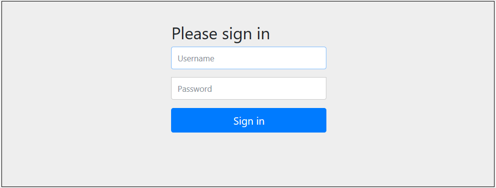

# Spinnaker Trial

## OpsMx Spinnaker Trial Overview
From this document, you will be able to get a basic hold of how to create and run a simple pipeline with OpsMx Trial Spinnaker. To get more familiar with Spinnaker, [Click here](https://www.spinnaker.io/concepts/) for detailed article.

Below are the features you can explore by using OpsMx Trial Spinnaker

* Creating a new pipeline from a pipeline template
	* Understand the stages in a pipeline
	
* Execute the Pipeline
	* Controlling the pipeline action using manual judagement stage
	
	
## Step by Step Use Case

* From the registration email, you should have received the login credentials

* Upon Successful login, click on Pipeline Templates to see the list of available templates. Click on Create Pipeline against BuildDeployApplication to create a new pipeline

* Select the application you want to create your pipeline in. In your case, there is an application already created - select it. Click Continue

* Give your pipeline a name and click Continue.

* Since the template does not have any variables to configure, you can dismiss the dialog that pops up.

* Now it will show you the different stages in the pipeline. It is configured out of the box to run as is. You can view the stages and their configuration by clicking on the stage.

* **Stages in a Pipeline**

	Spinnaker supports a number of pipeline stages out-of-the-box. The stages available to your pipeline depends on the provider. The list of stages supported by Spinnaker out of the box can be found here. Here is a description of the stages in this pipeline you just created:

	* **Configuration:** You define the properties of a pipeline here. This is the first stage in all pipelines. 
	
	* **Build:** Runs a Jenkins job that builds a Docker image.
	
	* **Staging_Deploy:** Deploys the docker image from the previous stage to a kubernetes account (dev-k8s-v2), In the deployment manifest definition, you can see how the image build in the “Build” stage is referenced.
	
	* **Run Test Suite 1:** This runs another Jenkins job that runs a bunch of tests against the deployed application.
	
	* **Verify Test:** This is a manual judgement stage - which is a stage where the user has to take a decision on whether to proceed or fail.
	
	Save your pipeline. Now you are ready to run your newly created pipeline.

* **Execute the Pipeline**

	* As you have seen in the configuration stage, you can have automatic triggers on a pipeline. But you can also manually trigger a pipeline execution by clicking on “Start Manual Execution”

	
	
	* The UI will show you the progress of the different pipeline stages. You can click on a stage to see the run details of that stage. Typically, the BuildDeployApplication pipeline will take approximately 4 minutes to complete.

	
	
* **Manual Judgement**

	* Remember the “Verify Test” is a manual judgement stage. The pipeline will wait here for the user to take an action. Select a reason and click on Continue to complete the pipeline run (or you can click on “Stop” to stop it!).

	
	
	* **Explore more pipeline templates, review their stages and run them.** 
	
		* **PromotetoProdBlueGreen:** This pipeline demonstrates the deployment rollout strategy options. This pipeline deploys the build from the BuildDeployApplication pipeline to production Kubernetes enabling red/black deployment strategy.

		* **BlueGreenRollback:** This demonstrates the calling of another pipeline from a pipeline.

