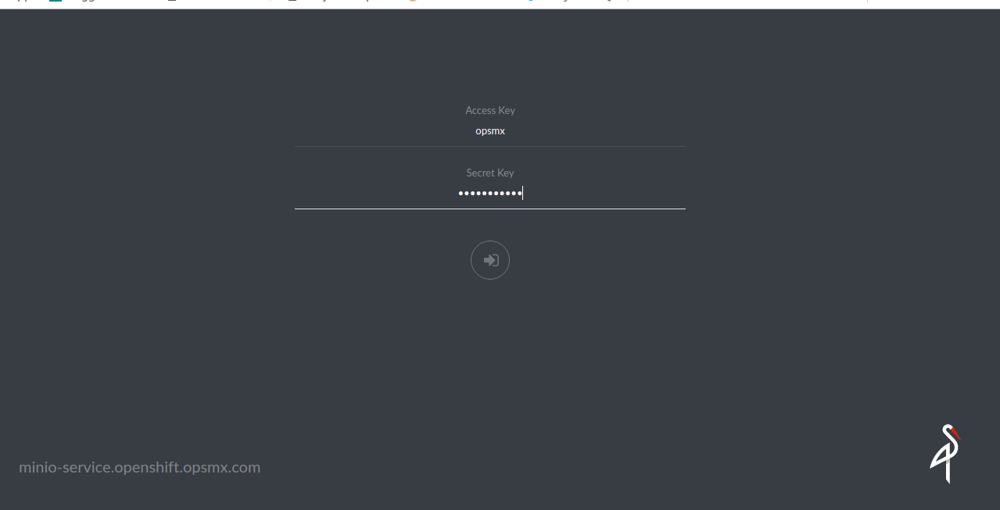
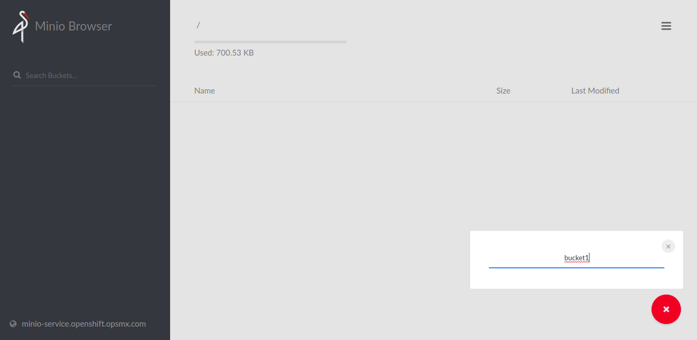

# How to Setup Minio Storage Service for Spinnaker on Openshift

This document will cover how to setup Minio storage service for Spinnaker in an OpenShift environment at a primary site. 

Spinnaker requires an external storage provider for persisting your Application settings and configured Pipelines. Because these data are sensitive and disruptive if lost, we recommend you using a hosted storage solution with the required level of availability and reliability.

The most commonly used storage service is the AWS S3 or GCP GS (Google Storage) to host this Spinnaker data. However, if you are looking for an on-prem hosted solution, we recommend using [Minio](https://www.minio.io/). 

[Minio](https://www.minio.io/) is an S3-compatible object store that users can host on-prem as a Docker container.  In this document, we will show how to use Minio as the persistent storage solution in the form of Pods on Openshift where Spinnaker can be running in Local-Debian or in the Distributed mode.

The Minio pods would be accepting the username/passwords as secrets in the base64 format which can be customized as per the user’s choice. 

Before we begin, below are the prerequisites for the installation. 

   * Openshift 3.6 or above
   * Familiarization with [Minio](https://www.minio.io/)
   * Understanding of how to set up [Minio as storage service for Spinnaker](https://www.spinnaker.io/setup/install/storage/minio/)
   
   
##Setting Up Primary Minio Storage Service in OpenShift

In this setup, we would be configuring Minio credentials as secret in namespace, configure a persistent store, and use Deployment object to instantiate Minio service on Openshift 3.9. 

We have also provided the link to the files to be accessed along with the screenshots.

**Step1: Configuring credentials used by Minio as a Secret**

Username or Access Key and Password or Secret Key needs to protected, so we can insert them in the form of the Object - Secret.  Secrets can be created using various methods. In this setup we will convert the username and password into base64 format and then copy the value into the secret.yaml as below.

If the username is myminiouser then the base64 value can be generated using the following command:

<pre><code>#username=$(echo myminiouser | base64)</code></pre>

Sample Secret.yaml file:

   <pre><code>apiVersion: v1
kind: Secret
metadata:
  name: minio-secret
type: Opaque
data:
  username: < base64 converted username >
  password: < base64 converted password >
</code></pre>

Create the secret in Openshift default namespace using the following command:
   
<pre><code> # oc create -f minio-secret.yml </code></pre>

[https://github.com/OpsMx/opsmxblogs/blob/master/minio/minio-secret.yml](https://github.com/OpsMx/opsmxblogs/blob/master/minio/minio-secret.yml)

Now,  we would need to create a Deployment Object for the secret. Deployment Object was chosen maintain the pods availability to avoid any disruption in the production environment.

**Step 2: Creating Persistent Volume for the deployment.**

In Openshift pods, local storage is transient. To have persistence, use a persistent volume and use that volume for Persistent Volume Claim (PVC) for storage for Minio. Create the PVC first named as “minio-pv” using the minio-pvc.yml manifest file

<pre><code># oc create -f minio-pvc.yml</code></pre>

<pre><code>apiVersion: v1
kind: PersistentVolumeClaim
metadata:
  # This name uniquely identifies the PVC. Will be used in deployment below.
  name: minio-pv
  labels:
    app: minio-storage-claim
spec:
  # Read more about access modes here: http://kubernetes.io/docs/user-guide/persistent-volumes/#access-modes
  accessModes:
    - ReadWriteMany
  resources:
    # This is the request for storage. Should be available in the cluster.
    requests:
storage: 10Gi</code></pre>

[https://github.com/OpsMx/opsmxblogs/blob/master/minio/minio-pvc.yml](https://github.com/OpsMx/opsmxblogs/blob/master/minio/minio-pvc.yml)

**Step 3: Creating Minio Instance and provide a service endpoint**

Create Minio instance using minio-deploy.yml manifest file. The deployment manifest uses the container with container ID minio/minio:latest from the Minio default repo

<pre><code># oc create -f minio-deploy.yml
</code></pre>

[https://github.com/OpsMx/opsmxblogs/blob/master/minio/minio.yml](https://github.com/OpsMx/opsmxblogs/blob/master/minio/minio.yml)

<pre><code>apiVersion: extensions/v1beta1
kind: Deployment
metadata:
  # This name uniquely identifies the Deployment
  name: minio-deployment
spec:
  strategy:
    type: Recreate
  template:
    metadata:
      labels:
        # Label is used as selector in the service.
        app: minio
    spec:
      # Refer to the PVC created earlier
      volumes:
      - name: storage
        persistentVolumeClaim:
          # Name of the PVC created earlier
          claimName: minio-pv
      containers:
      - name: minio
        # Pulls the default Minio image from Docker Hub
        image: minio/minio
        args:
        - server
        - /storage
        env:
        # Minio access key and secret key
        - name: MINIO_ACCESS_KEY
          valueFrom:
            secretKeyRef:
              name: minio-secret
              key: username
        - name: MINIO_SECRET_KEY
          valueFrom:
            secretKeyRef:
              name: minio-secret
              key: password
        ports:
        - containerPort: 9000
        # Mount the volume into the pod
        volumeMounts:
        - name: storage # must match the volume name, above
          mountPath: "/storage"</code></pre>

This deployment manifest creates an instance of Minio, attach the persistent volume and applies the secrets specified in the namespace to configure Minio service. 

Once, the instance is running create a Service for the Deployment to allow access by clients. The service would be created as a ClusterIP using the manifest file specified in minio-svc.yml

<pre><code># oc create -f minio-svc.yml
</code></pre>

<pre><code>apiVersion: v1
kind: Service
metadata:
  name: minio-service
spec:
  type: ClusterIP
  ports:
    - port: 9000
      targetPort: 9000
      protocol: TCP
  selector:
    app: minio</code></pre>

[https://github.com/OpsMx/opsmxblogs/blob/master/minio/minio-svc.yml](https://github.com/OpsMx/opsmxblogs/blob/master/minio/minio-svc.yml)

**Note:** If you need to create an external IP or route exposed to the outside network, please change the service spec to NodePort.

**Step 4: Create Buckets on the Minio Server**

The Minio servers store the data into **Buckets, Bucket** is equivalent of a drive or mount point in filesystems and should not be treated as folders. **Minio** does not place any limits on the number of **buckets** created per user. On Amazon S3, each account is limited to 100 **buckets**.

Login into the Minio server that you created and use the Access Key(username) and Secret Key (Password) that you provided on the secret object

Once logged in, you can create a bucket from the Add Symbol ‘+’ at the bottom right corner of the screen and name the bucket, here we named the bucket as bucket1.

That’s it. We are done. You have created the primary Minio storage service with a PVC along with the buckets that would be storing the data.  We will cover the replication in the next document.
